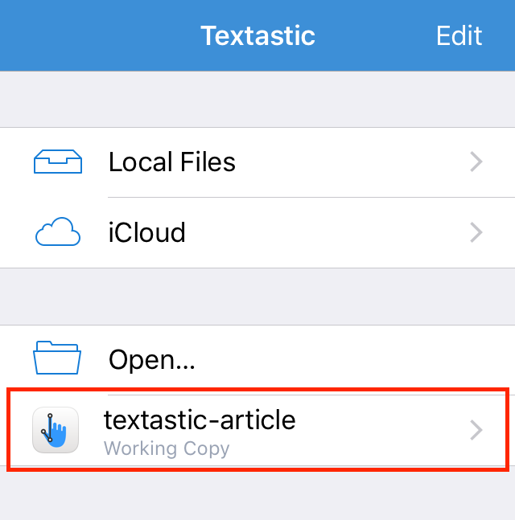

# Opening external folders in Textastic 6.2

It is now possible to open entire folders from the iOS Git client [Working Copy](https://workingcopyapp.com) using the [iOS document picker](https://developer.apple.com/library/ios/documentation/FileManagement/Conceptual/DocumentPickerProgrammingGuide/Introduction/Introduction.html). Previously you could only open individual files.

These are the steps necessary to open a Git repository in Textastic 6.2:

* Make sure *Working Copy* is installed on your device.
* Tap on "Open…" in Textastic.
* Select "Working Copy".  
  
* Navigate to an existing Git repository or clone/initialize a new one.
* Tap on "Pick" to open the repository.  
  

The repository is now added as an external folder below the "Open…" command and can be used just as "Local Files" or "iCloud": You can edit existing files and add new ones. You can download and upload files. Web preview is fully supported. Changes you make will be immediately shown in Working Copy. You can then commit your changes in Working Copy. This works great in Split View mode on the iPad.

You can see this in action in the short video at http://bit.ly/textastic62
